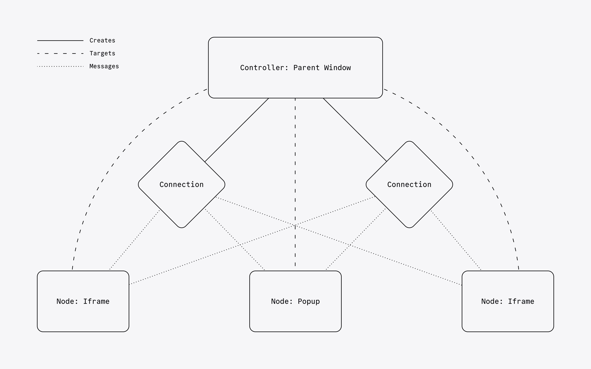

# @sanity/comlink

A library for one-to-many cross-origin communication between Window contexts, built on the postMessage API.

## Install

```bash
npm install @sanity/comlink
```

## Usage

`@sanity/comlink` provides a mechanism for sending messages between a parent and one or more child `Window` contexts. Define Nodes and Channels and `@sanity/comlink` will establish and maintain connections to new target contexts automatically.



### Setup

First, define the types of messages you will send and receive. The `data` and `response` values must be a serializable object, or `undefined`.

Define a message a Channel will send to a Node.

```ts
type ChannelMessage = {
  type: 'focus'
  data: {
    selector: string
  }
}
```

Define messages the Node will send to a Channel. Note that responses are only supported from Channels, i.e. on Node message types.

```ts
interface GreetingMessage {
  type: 'greeting'
  data: {
    message: string
  }
}

interface ItemFetchMessage {
  type: 'fetch-item'
  data: {
    id: string
  }
  response: {
    data: Record<string, unknown> | undefined
  }
}

type NodeMessage = GreetingMessage | ItemFetchMessage
```

### Parent Context

In the parent `Window` context, create a Controller. This is used to create and manage Channels, which connect to Nodes in other `Window` contexts. Provide a `targetOrigin` to ensure messages are only sent to and received from trusted origins.

```ts
import {createController} from '@sanity/comlink'

const controller = createController({
  targetOrigin: 'https://target-origin.com',
})
```

Add a target `Window` context, such as an iframe.

```ts
const iframe = document.querySelector('iframe#my-iframe')

controller.addTarget(iframe)
```

Define a Channel by specifying its name and the name of the Node it will interface with. Optionally enable heartbeat monitoring to allow automatic recovery on unexpected disconnects.

```ts
const channel = controller.createChannel<ChannelMessage, NodeMessage>({
  name: 'parent',
  heartbeat: true,
  connectTo: 'child',
})
```

Listen for status changes.

```ts
const unsubscribe = channel.onStatus((event) => {
  console.log('Status of', event.connection, 'changed to', event.status)
})
```

Listen for messages...

```ts
const unsubscribe = channel.on('greeting', (data) => {
  console.log(data.message)
})
```

...return responses...

```ts
const unsubscribe = channel.on('fetch-item', (data) => {
  return items.find((item) => item.id === data.id)
})
```

...or send messages to all Nodes.

```ts
channel.post('focus', {selector: 'foo'})
```

### Child Context

In the child `Window` context, create a Node. Provide a name and the name of the Channel it should interface with.

```ts
import {createNode} from '@sanity/comlink'

const node = createNode<NodeMessage, ChannelMessage>({
  name: 'child',
  connectTo: 'parent',
})
```

Listen for status changes.

```ts
const unsubscribe = node.onStatus((status) => {
  console.log('Status changed to', status)
})
```

Send messages...

```ts
node.post('greeting', {message: 'Hello, Comlink!'})
```

...fetch data...

```ts
const item = await node.fetch('fetch-item', {id: 'foo'})
```

...or listen for incoming messages.

```ts
const unsubscribe = node.on('focus', (data) => {
  document.querySelector(data.selector)?.focus()
})
```

## Core Concepts

### Controllers

Controllers are responsible for managing the lifecycle of channels to one or more Nodes. They handle the creation of Channels, adding and removing targets, and managing the overall communication flow.

Controllers ensure that messages are correctly routed to the appropriate Node and that responses are handled appropriately.

Once the Controller is created, `Window` contexts (i.e. iframes and popups) can be added, and connections established to Nodes within those contexts.

### Channels

Channels are the underlying mechanism that facilitate communication between Controllers and Nodes. They are responsible for establishing and maintaining connections.

Channels also support heartbeat monitoring to detect and recover from connection failures.

### Nodes

Nodes are created within child `Window` contexts (e.g., iframes or popups) and establish connections to Channels in the parent `Window` context.

Nodes provide a simple interface for posting messages, fetching data, and listening for incoming messages.

## Connection States

Node and Channel connections can be in the following states:

- `idle`: Initial state before connection
- `handshaking`: Establishing connection
- `connected`: Active connection
- `disconnected`: Connection terminated (Connections only)
